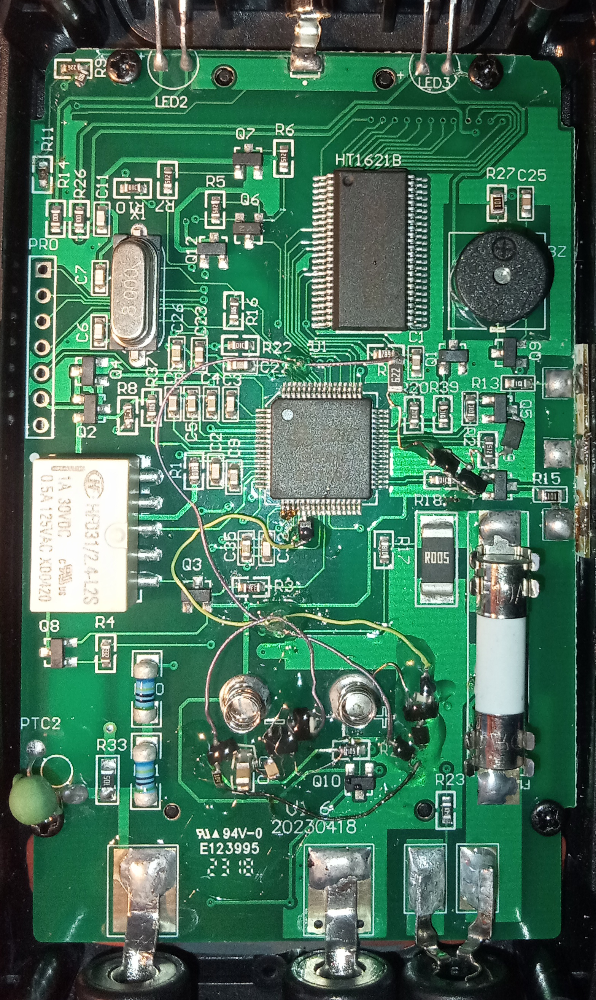
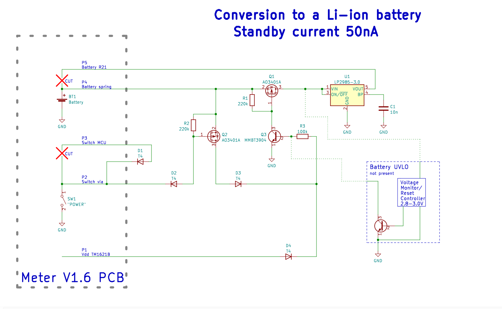

# Aneng_SZ02
Hardware modifications for Aneng SZ02 V1.6. Li-Ion battery, infinite backlight

I do not recommend doing any modifications if you are not familiar with smd soldering! Remember to clean the flux after soldering.

If you are considering buying this meter, please watch my videos first. It has many downsides.
https://www.youtube.com/watch?v=uEDUYeMHF6U
https://www.youtube.com/watch?v=RqifJKY3i2E

LP2985 TI DS:

7.4.3 Dropout Operation

If the input voltage is lower than the nominal output voltage plus the specified dropout voltage, but all other
conditions are met for normal operation, the device operates in dropout mode. In this mode, the output voltage
tracks the input voltage. During this mode, the transient performance of the device becomes significantly
degraded because the pass transistor is in the ohmic or triode region, and acts as a switch. Line or load
transients in dropout can result in large output voltage deviations.
